# Eclipse

## Installation
- Download Eclipse Java EE
- 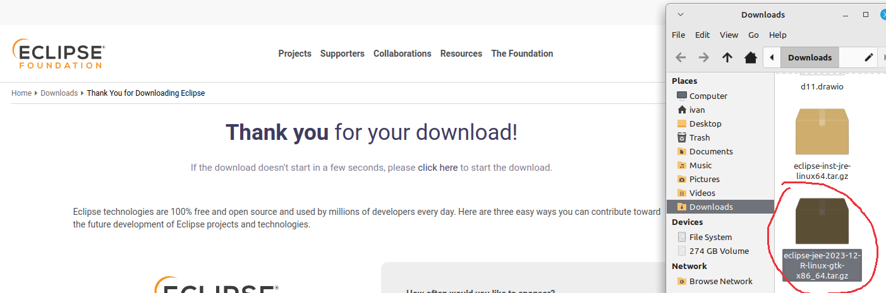
- Unarchive using `tar -xvf ./eclipse-jee-2023-12-R-linux-gtk-x86_64.tar.gz `
- `cd eclipse`
- `chmod +x ./eclipse`
- Run using: `./eclipse`

## Configure shortcuts
- **Configure undo/redo**
    - 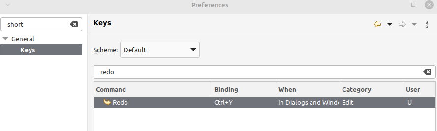
    - 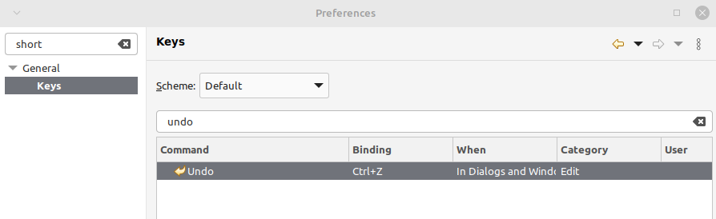
    - 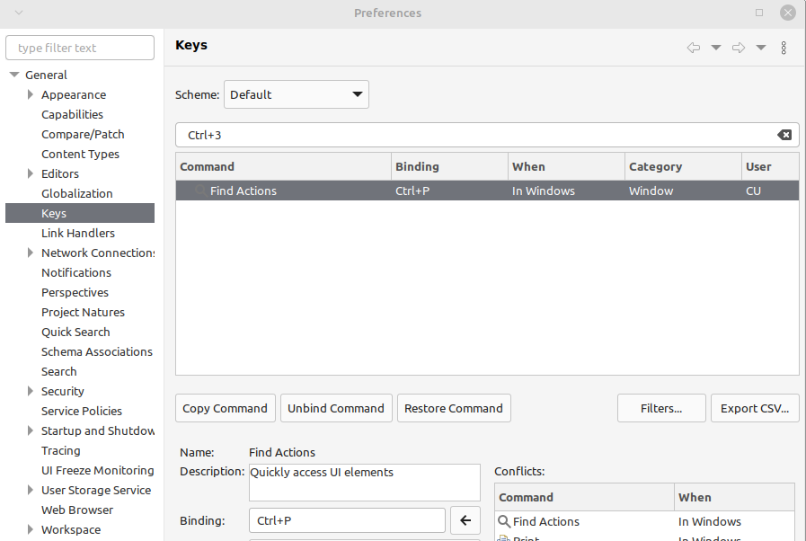
    - Evaluate expression: 
      - 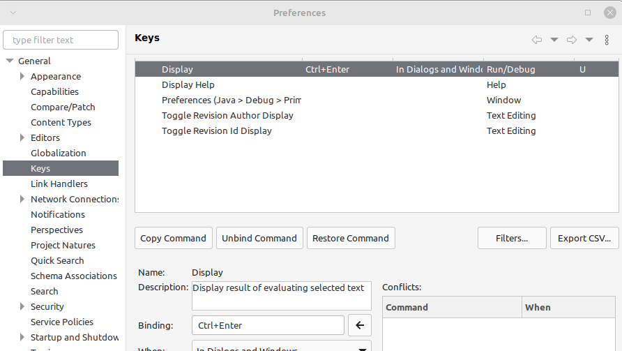
    - 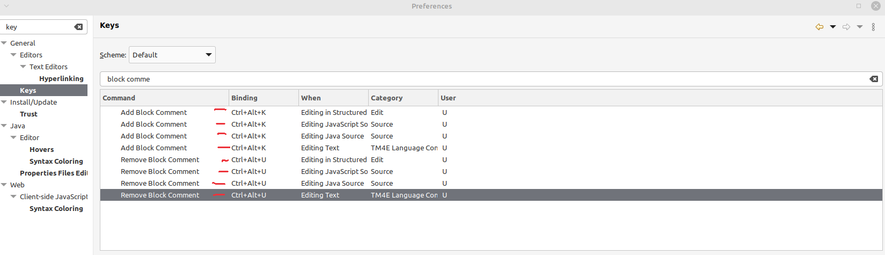
    - 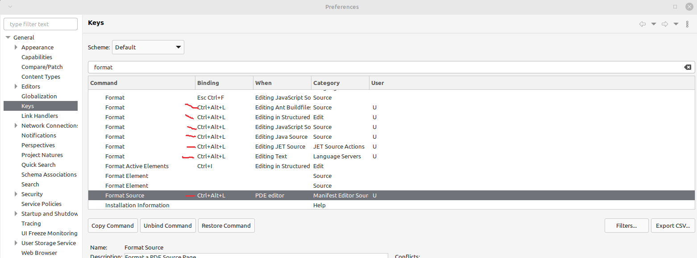
    - 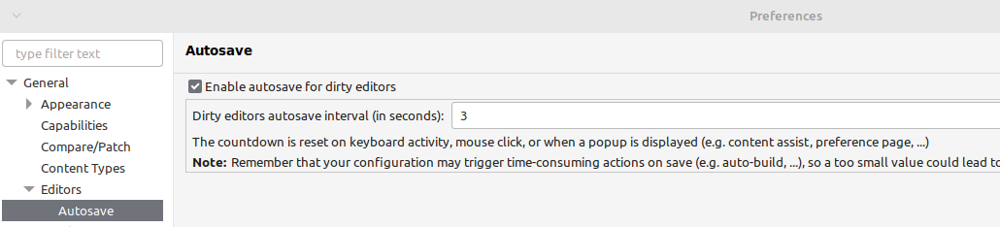
    - 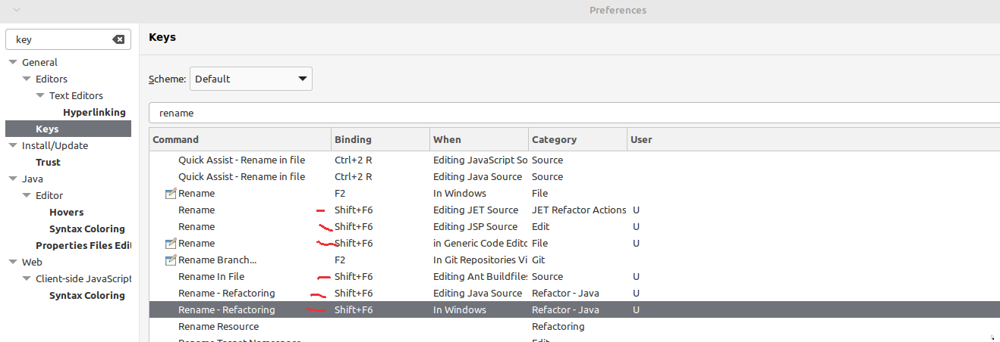
    - 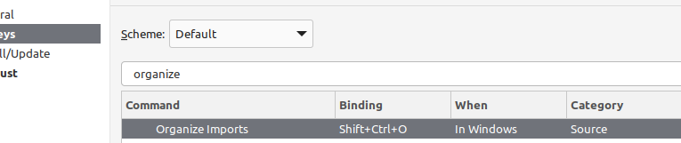
    - 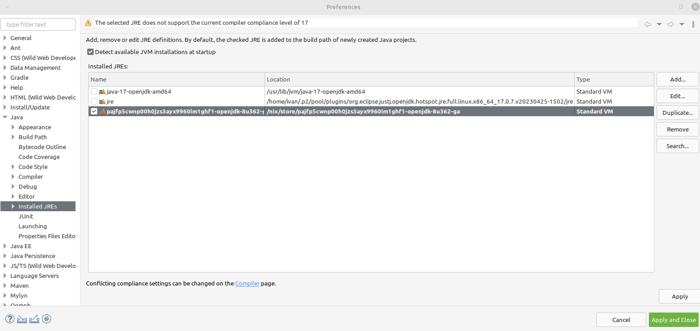
    - 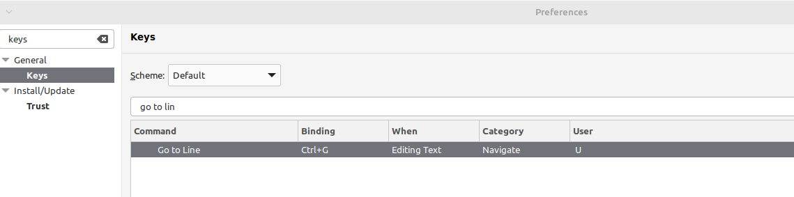
    - 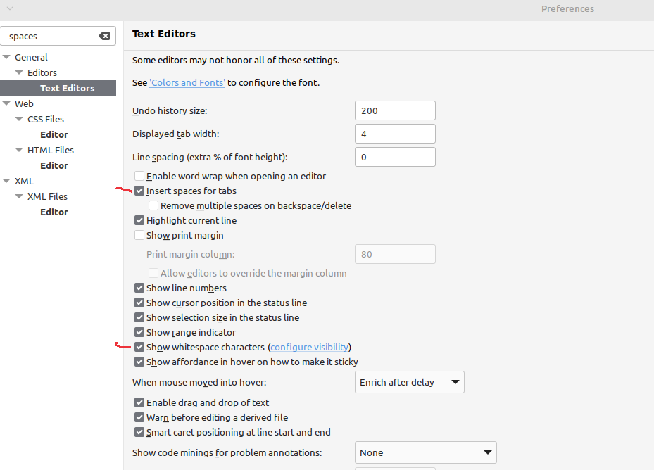
    - 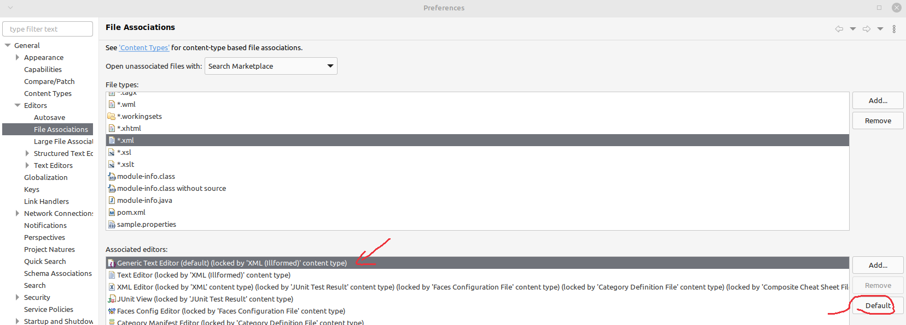

## Use specific JDK
- 

## Checkstyle plugin
- 
- 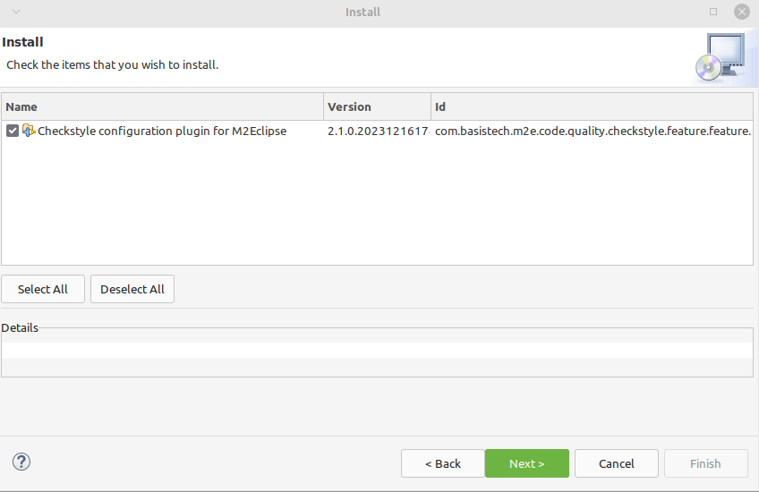

- https://www.baeldung.com/checkstyle-java
- https://stackoverflow.com/questions/57073005/failed-during-checkstyle-configuration-unable-to-parse-configuration-stream
