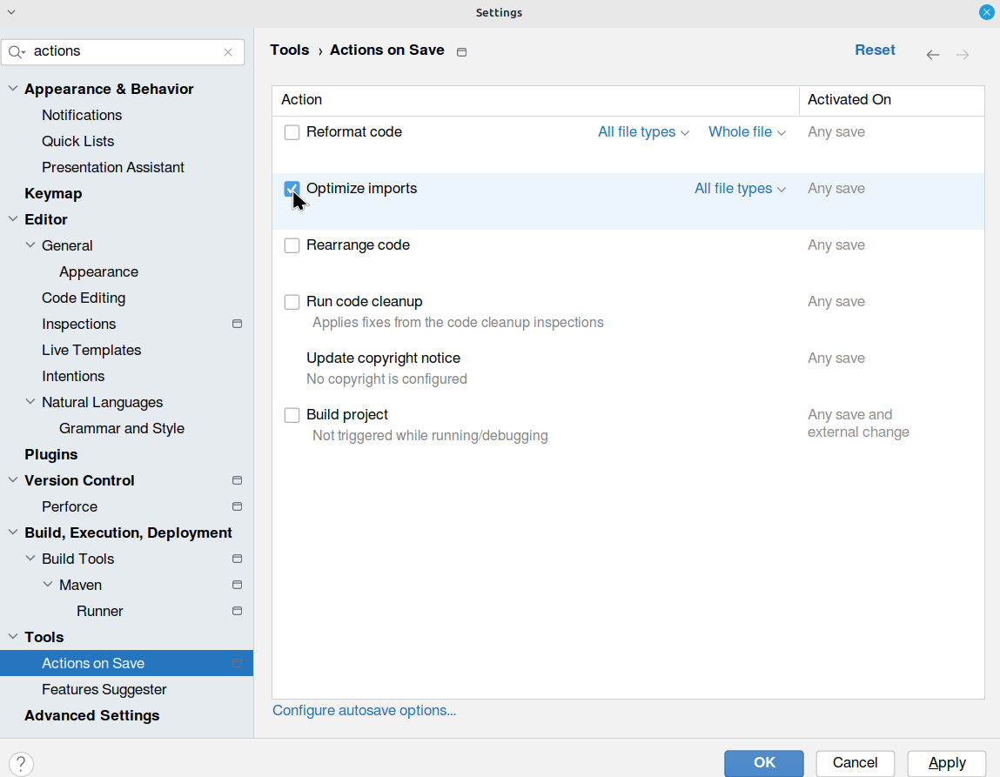
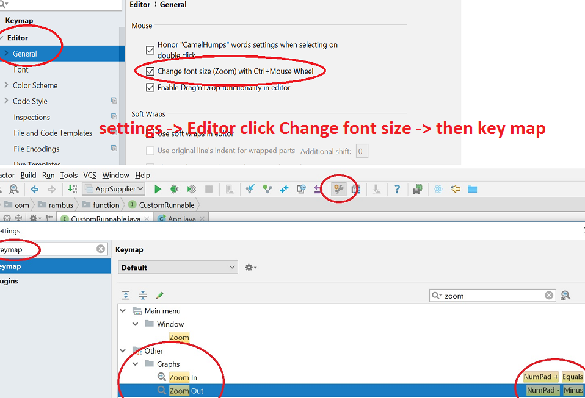
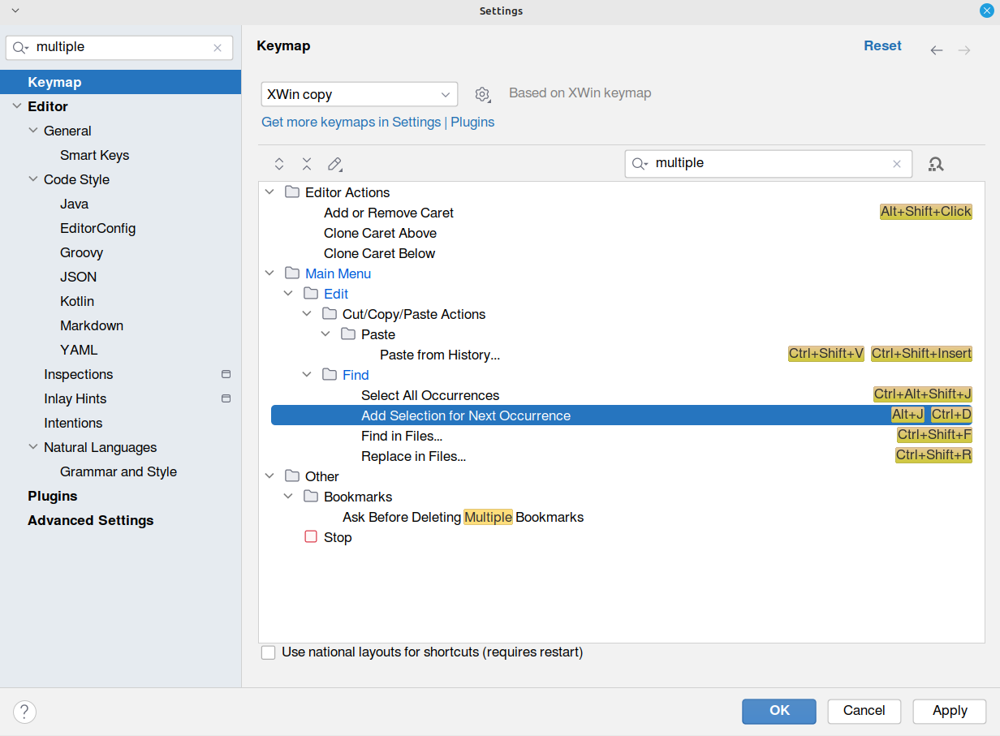

# IntelliJ Idea Comminity Settings

## Shortcuts
```sh
# Ctrl + Alt + L -> format section / whole source file
```

## Organize imports on save
- 

## Scale actions
- 

## Add selection for next occurrence
- 

