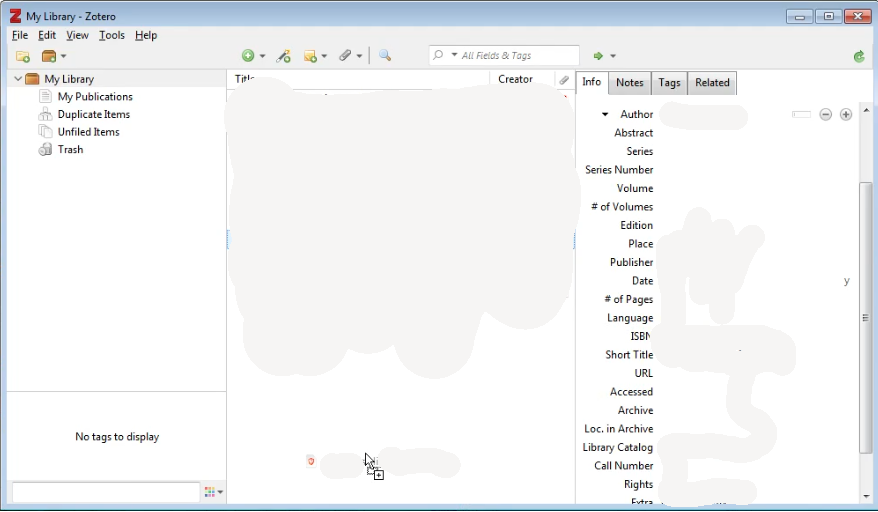
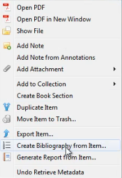
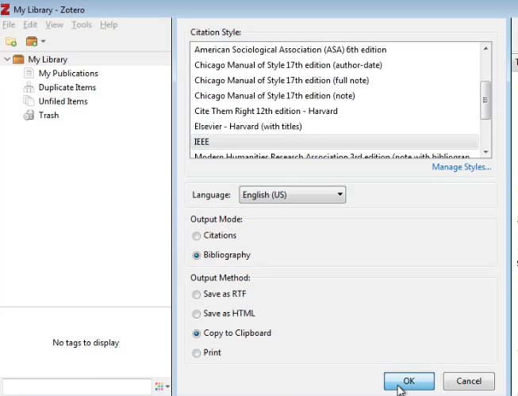
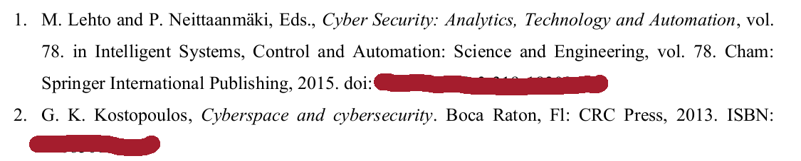

## Zotero tool

### Generate references for example bachelor's/master's project

#### Step 1 - drag-and-drop pdf ot the book
- 
#### The book can be converted to reference provided this icon is drawn
It indicated that the pdf contains all required metadata to generate a valid reference.
- 
#### Step 2
- 
#### Step 3
- 
#### Step 4
- Paste to your document
#### Example
- 

